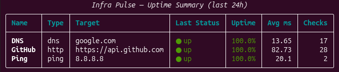
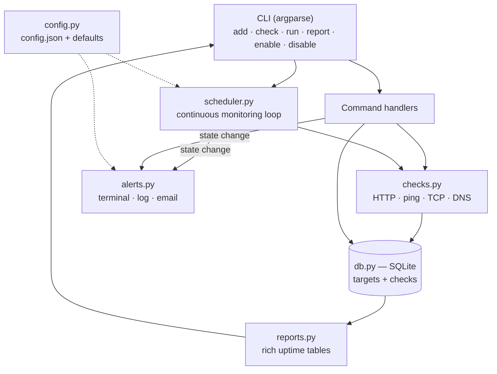

# Infra Pulse


A command-line uptime monitor for your infrastructure. Infra Pulse watches a list of
targets — websites, APIs, servers, open ports, and DNS records — checks them on
per-target schedules, stores every result in a local SQLite database, and raises alerts
in the terminal, a log file, and (optionally) by email whenever a target changes state.

It's a small, self-contained monitoring tool you can run on any machine to keep an eye
on the services you care about.



## Architecture



## Quick Start (Docker)

The published image runs anywhere Docker is installed — no cloning, no Python setup:

```bash
# Run a one-off check (state persists in the pulse_data volume)
docker run --rm -v pulse_data:/data ghcr.io/abulyousuf/infra-pulse \
  add --name "GitHub" --type http --target https://api.github.com
docker run --rm -v pulse_data:/data ghcr.io/abulyousuf/infra-pulse check --name "GitHub"

# View the uptime report
docker run --rm -v pulse_data:/data ghcr.io/abulyousuf/infra-pulse report

# Or run continuous monitoring as a background service
docker run -d --name infra-pulse -v pulse_data:/data ghcr.io/abulyousuf/infra-pulse run
docker logs -f infra-pulse
```

## Features

- **Four check types** — HTTP/HTTPS requests, ICMP ping, raw TCP port checks, and DNS
  resolution, all behind one uniform result format.
- **Continuous monitoring** — each target is checked on its own configurable interval.
- **Persistent history** — every result is stored in SQLite, so uptime statistics
  survive restarts and are queryable over any time window.
- **Transition-based alerts** — alerts fire only when a target *changes state*
  (up → down, down → up), so a prolonged outage produces one alert, not hundreds.
- **Multiple alert channels** — colour-coded terminal output and a log file (on by
  default), plus optional email via SMTP.
- **Readable reports** — uptime percentage, average response time, and recent history,
  rendered as clean tables in the terminal.

## Requirements

- Python 3.10 or newer
- A working `ping` binary (standard on Linux, macOS, and Windows) for ping checks

## Installation (from source)

```bash
git clone https://github.com/abulyousuf/infra-pulse.git
cd infra-pulse
python -m venv .venv
source .venv/bin/activate        # On Windows: .venv\Scripts\activate
pip install -r requirements.txt
```

## Usage

```bash
# Add a few targets to monitor
python main.py add --name "GitHub API" --type http --target https://api.github.com
python main.py add --name "My Server"  --type ping --target 8.8.8.8
python main.py add --name "HTTPS Port" --type tcp  --target example.com:443
python main.py add --name "DNS"        --type dns  --target example.com

# List everything you're monitoring
python main.py list

# Run a single one-off check
python main.py check --name "GitHub API"

# Start continuous monitoring (Ctrl+C to stop)
python main.py run

# In another terminal, view the uptime report
python main.py report
```

## Commands

| Command   | Description                                                            |
|-----------|-----------------------------------------------------------------------|
| `add`     | Add a monitoring target (`--name`, `--type`, `--target`, `--interval`)|
| `list`    | List all configured targets                                           |
| `remove`  | Remove a target by name (`--name`)                                     |
| `enable`  | Re-activate a paused target (`--name`)                                 |
| `disable` | Pause a target without deleting its history (`--name`)                 |
| `check`   | Run a single check immediately and print the result (`--name`)        |
| `run`     | Start the continuous monitoring loop                                   |
| `report`  | Show the uptime summary, or detailed history with `--name`            |

### Target formats

| Type   | `--target` format        | Example                  |
|--------|--------------------------|--------------------------|
| `http` | a full URL               | `https://example.com`    |
| `ping` | a hostname or IP address | `8.8.8.8`                |
| `tcp`  | `host:port`              | `example.com:443`        |
| `dns`  | a hostname               | `example.com`            |

### More examples

```bash
# Check a critical API every 15 seconds instead of the default 60
python main.py add --name "Critical API" --type http --target https://api.example.com --interval 15

# Detailed recent history for one target
python main.py report --name "Critical API" --limit 50

# Uptime summary over the last 7 days (168 hours)
python main.py report --hours 168

# Pause and resume a target without losing its history
python main.py disable --name "Critical API"
python main.py enable  --name "Critical API"
```

## Email Alerts (optional)

Email is off by default. To enable it, copy the example config and edit it:

```bash
cp config.example.json config.json
```

Set `alerts.email.enabled` to `true` and fill in your SMTP details. For Gmail, create
an [App Password](https://support.google.com/accounts/answer/185833) (requires 2-Step
Verification) rather than using your normal password. `config.json` is git-ignored, so
your credentials are never committed.

## Data Model

Infra Pulse stores everything in a local SQLite database with two tables: `targets`
(what to monitor) and `checks` (every result, with timestamp, status, and response
time). See [docs/data-dictionary.md](docs/data-dictionary.md) for full column
definitions, and the entity-relationship diagram below.


## Design Decisions

A few choices worth calling out:

- **Transition-based alerting.** Alerts fire only when a target *changes* state (up→down, down→up), not on every failed check — so a two-hour outage produces two alerts, not 120. The scheduler tracks last-known status in memory to detect transitions.

- **Uniform check contract.** Every probe (HTTP, ping, TCP, DNS) returns the same `{status, response_time_ms, detail}` shape, so the scheduler, storage, and reporting layers treat all four types identically without special-casing.

- **SQLite with WAL journal mode.** Write-Ahead Logging lets the monitoring loop write results while `report` reads concurrently, without lock contention.

- **UTC timestamps compared in Python.** Timestamps are stored as ISO 8601 UTC text; time-window queries compute the cutoff in Python to match the stored format, avoiding a subtle string-comparison mismatch with SQLite's `datetime()`.

- **Best-effort alerting.** Alert delivery is wrapped so a failure logs and continues — monitoring must never crash because an alert couldn't be sent.

- **Environment-configurable paths.** The database and config locations are read from environment variables, which lets the same code run in tests (temp DB), locally, and in Docker (state on a mounted volume).

## Project Structure

```
infra-pulse/
├── infra_pulse/
│   ├── cli.py           # argparse commands, wired to handlers
│   ├── db.py            # SQLite schema + all data access
│   ├── checks.py        # http / ping / tcp / dns probe logic
│   ├── scheduler.py     # the continuous monitoring loop
│   ├── alerts.py        # terminal/log + email alerting
│   ├── reports.py       # rich-rendered uptime reports
│   └── config.py        # loads and merges config.json
├── tests/               # pytest suite
├── docs/                # ERD and data dictionary
├── .github/workflows/   # CI (lint/test/build) + release to GHCR
├── main.py              # entry point
├── Dockerfile           # container image
├── docker-compose.yml   # one-command daemon deployment
├── config.example.json  # template config (copy to config.json)
├── requirements.txt     # runtime dependencies
├── requirements-dev.txt # dev dependencies (pytest, ruff)
├── pyproject.toml       # pytest + ruff configuration
├── LICENSE              # MIT
└── README.md
```

## Running the Tests

```bash
pip install -r requirements-dev.txt
pytest
```

The suite covers the data layer (against isolated temporary databases), the check
decision rules (with mocked network calls, so tests run offline and instantly), the
uptime calculations, and the transition-based alerting logic.

## Configuration Notes

- The SQLite database (`infra_pulse.db`) and log file (`pulse.log`) are created
  automatically in the working directory on first run.
- You can override their locations with environment variables: `INFRA_PULSE_DB` (path
  to the database) and `INFRA_PULSE_CONFIG` (path to the config file).

## License

Released under the MIT License. See [LICENSE](LICENSE) for details.
