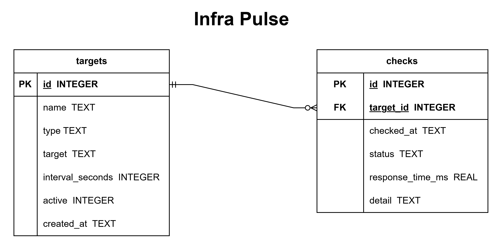

# Infra Pulse

A containerised CLI uptime monitor for websites, servers, ports, and DNS — Python, SQLite, Docker, and a full CI/CD pipeline with GitHub Actions.

**Work in progress.**

## Data Model

See [docs/data-dictionary.md](docs/data-dictionary.md) for full column definitions.